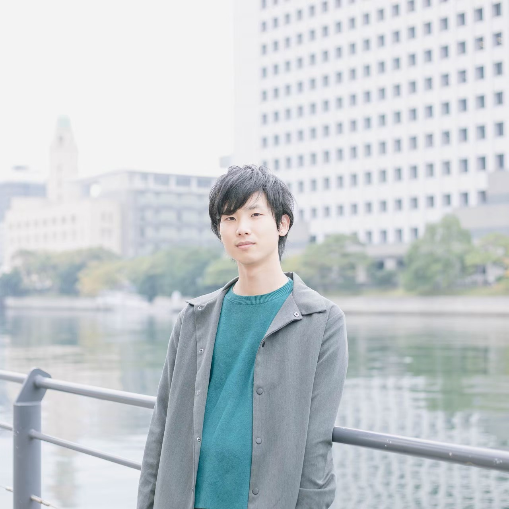

# 株式会社おもしろテクノロジー
## Vision
### 3000年後の世界でかがやくおもしろテクノロジー
核弾頭ミサイルのスイッチが押されてしまうだけで滅びてしまうこの世界で、ものづくりを始めとした文化を後の文明に継承するために活動していきます。

## Service
### 情報保存サービス
ガラスに好きな情報をプリントして土の中に埋めます。ガラスは経年劣化が少ない素材であるため、長期間の情報の保存ができます。
土に埋めたガラスは人類が滅びた後に掘り起こされるかもしれません。

### Webメディア "おもしろテクノロジー"
ものづくりクリエイターが集うおもしろいWebメディアを運営します。
創作したモノだけでなく、その過程（モチベーション、哲学、生活）にも目を向けることで今後の社会及び世界を生き抜く力、及び価値創造の能力を醸成を目指します。

### 問い合わせ
問い合わせはこちらのFormまでお願いいたします。

## Member
 

### 野呂 歩希 Noro Ibuki
代表取締役社長  
1997生まれ。岩手県出身。  
国立一関工業高等専門学校卒業後、新卒でソニーグローバルマニュファクチャリング&オペレーションズ株式会社に入社。液晶テレビのソフトウェア設計・開発を担当。退社後、株式会社eXmotionにて製造業のソフトウェア開発現場の支援に従事。（在職中）  
2020年より北陸先端科学技術大学院大学先端科学先端科学技術研究科情報系でソフトウェア品質・オブジェクト指向の研究を行う。  
2022年10月に株式会社おもしろテクノロジーを設立。
## 会社情報
### 会社名
株式会社おもしろテクノロジー
### 設立
2022年10月19日
### 所在地
〒144-0051  
東京都大田区西蒲田7-4-4 小山第二ビル6F
### 事業内容
印刷物の企画、編集、出版、販売、及び地中への保存  
Webメディア "おもしろテクノロジー"の企画・運営  
組み込み向けソフトウェアの企画/開発
